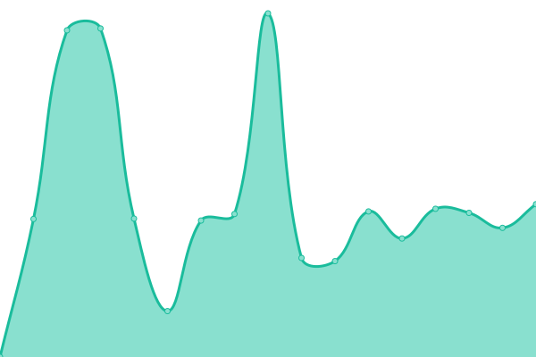
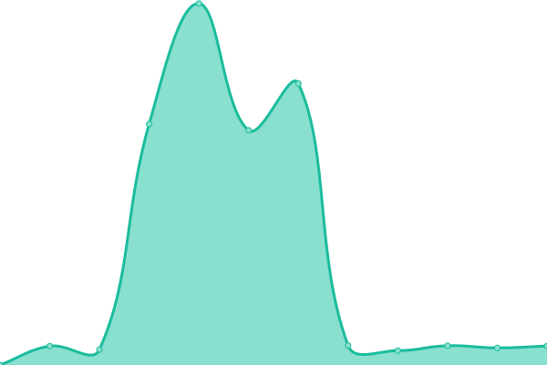

# [📈 Live Status](https://apistatus.site): <!--live status--> **🟧 Partial outage**

This repository contains the open-source uptime monitor and status page for [James Finstrom](http://g3p0.xyz), powered by [Upptime](https://github.com/upptime/upptime).

With [Upptime](https://upptime.js.org), you can get your own unlimited and free uptime monitor and status page, powered entirely by a GitHub repository. We use [Issues](https://github.com/jfinstrom/apistatus/issues) as incident reports, [Actions](https://github.com/jfinstrom/apistatus/actions) as uptime monitors, and [Pages](https://apistatus.site) for the status page.

<!--start: status pages-->
<!-- This summary is generated by Upptime (https://github.com/upptime/upptime) -->
<!-- Do not edit this manually, your changes will be overwritten -->
<!-- prettier-ignore -->
| URL | Status | History | Response Time | Uptime |
| --- | ------ | ------- | ------------- | ------ |
|  [CIP Mirror](https://mirror.clearlyip.com/all-15.0.xml) | 🟩 Up | [cip-mirror.yml](https://github.com/jfinstrom/apistatus/commits/HEAD/history/cip-mirror.yml) | 

 937ms
     
 | 

<a href="https://apistatus.site/history/cip-mirror">100.00%</a>
    

|  [FreePBX Mirror HTTP Endpoint](http://mirror.freepbx.org/all-15.0.xml) | 🟥 Down | [free-pbx-mirror-http-endpoint.yml](https://github.com/jfinstrom/apistatus/commits/HEAD/history/free-pbx-mirror-http-endpoint.yml) | 

 5078ms
     
 | 

<a href="https://apistatus.site/history/free-pbx-mirror-http-endpoint">100.00%</a>
    

|  [FreePBX Mirror HTTPS Endpoint](https://mirror.freepbx.org/all-15.0.xml) | 🟩 Up | [free-pbx-mirror-https-endpoint.yml](https://github.com/jfinstrom/apistatus/commits/HEAD/history/free-pbx-mirror-https-endpoint.yml) | 

 1474ms
     
 | 

<a href="https://apistatus.site/history/free-pbx-mirror-https-endpoint">100.00%</a>
    

|  [Personal Page](https://g3p0.xyz) | 🟩 Up | [personal-page.yml](https://github.com/jfinstrom/apistatus/commits/HEAD/history/personal-page.yml) | 

 140ms
     
 | 

<a href="https://apistatus.site/history/personal-page">100.00%</a>
    

|  [TCP ping](1.1.1.1) | 🟩 Up | [tcp-ping.yml](https://github.com/jfinstrom/apistatus/commits/HEAD/history/tcp-ping.yml) | 

 62ms
     
 | 

<a href="https://apistatus.site/history/tcp-ping">100.00%</a>
    

<!--end: status pages-->

[**Visit our status website →**](https://apistatus.site)

## 📄 License

- Powered by: [Upptime](https://github.com/upptime/upptime)
- Code: [MIT](./LICENSE) © [James Finstrom](http://g3p0.xyz)
- Data in the `./history` directory: [Open Database License](https://opendatacommons.org/licenses/odbl/1-0/)
